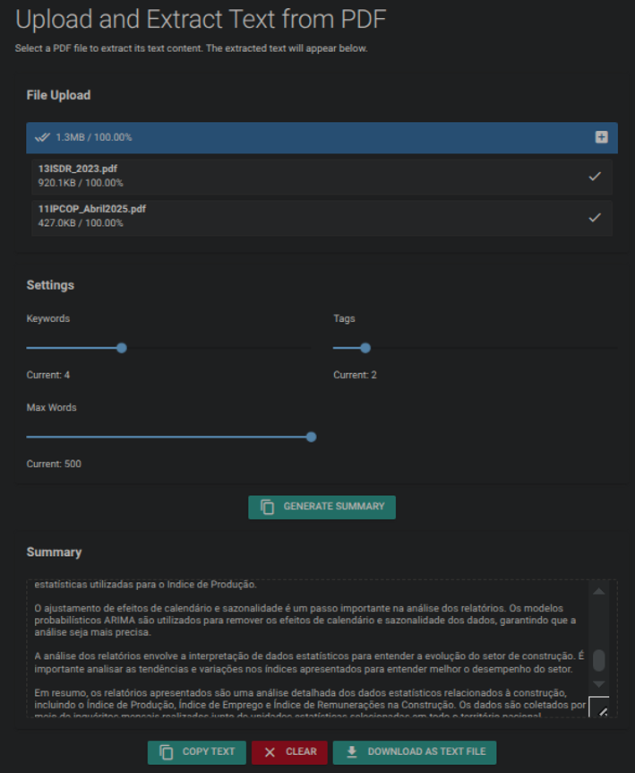

# D12.1 – WP12 Prototypes: Hackathon Outcomes and Reflections

## Deliverable description

This deliverable (D12.1 – “WP12 LLM Prototype A”) presents the outcomes of Task T12.2 within Work Package 12 (WP12) of the AIML4OS project. The task aimed at developing at least two demonstrators based on the use of pre-existing large language models (LLMs), exploring their application to key areas in official statistics. The prototypes were developed through an international hackathon held in Lisbon in June 2025.

The main application and documentation are available in English. Components and supporting tools may be reused and adapted by statistical organisations in different countries, with reference code and architectural mappings provided.

## Abstract

This report is submitted in accordance with Deliverable D12.1 within Work Package 12 (WP12) of the AIML4OS project. The aim of this deliverable was to explore practical applications of existing LLMs within official statistics through the development of demonstrators. The prototypes were produced during a collaborative hackathon involving six national statistical institutes, and reflect diverse use cases including dissemination, data extraction, and web content monitoring. The deliverable includes documentation, architecture diagrams, and reflections on technical and organisational aspects of LLM integration.

## Introduction

This document presents the outcome of the prototype work carried out within Work Package 12 (WP12) of the AIML4OS project, with a specific focus on activities leading up to and during the WP12 hackathon held in Lisbon in June 2025. The deliverable D12.1, titled "WP12 LLM prototype A," is classified as a demonstrator and report, and aims to showcase concrete applications of pre-existing Large Language Models (LLMs) in official statistics. It is produced as part of Task T12.2, which targets the development of at least two prototypes in key areas such as data and metadata handling, automated text generation, production code improvement, chatbot-based dissemination, and the analysis of large documents or web content.

AI systems involving generative models are composed not only of the models themselves but also of surrounding components such as APIs, frameworks, orchestration layers, RAG pipelines, and interface tools. Architectural choices regarding these components have significant implications for important aspects such as the feasibility of local deployment, data protection strategies, and the ability to mitigate issues like hallucination or low explainability. While the purpose of Task T12.1 is to provide guidance on these architectural aspects, the hands-on work carried out in Task T12.2 offers practical insights that help ground that guidance in real-world constraints. This is particularly important in a fast-moving domain such as generative AI, where purely theoretical guidance quickly risks becoming obsolete.

To support this work, a reference diagram of generic architectural components has been used throughout the WP12 process. Originally developed within UNECE collaboration, this model illustrates how foundational AI models relate to surrounding infrastructure such as APIs, vector stores, frameworks, and user interfaces. The figure below is used throughout the report as a point of reference. The complete report can be found here: [https://unece.org/statistics/documents/2025/09/reports/generative-ai-official-statistics-hlg-mos-report](https://unece.org/statistics/documents/2025/09/reports/generative-ai-official-statistics-hlg-mos-report)

## Approach and Methodology

Task T12.2 was carried out through an iterative, collaborative approach that included preparatory meetings and a two-day hackathon held in Lisbon. The hackathon brought together participants from Portugal, the Netherlands, Sweden, Ireland, and Norway, with technical support from INSEE (France), who also provided infrastructure expertise via WP3.

A shared architectural perspective was adopted early in the process, and a joint set of evaluation criteria was established to guide prototype selection and development. These criteria included: efficiency gain, reusability, data accessibility, on-premise compatibility, feasibility, robustness of evaluation, expected lifespan, and whether the use case could be considered a low-hanging fruit for national statistical institutes.

Developing usable prototypes using realistic data, while still being able to openly share the results, was a recurring challenge. Significant effort went into designing use cases and workflows that could demonstrate practical value without relying on sensitive or non-shareable data sources. To address this, the group made use of the SSPCloud environment delivered by WP3. This platform provided a ready-to-use development space that supported experimentation with generative AI in a secure, reproducible and sharable setting.

SSPCloud also recently introduced support for locally hosted AI models, which aligned well with architectural goals related to data protection and on-premise compatibility. The availability of direct support from INSEE during the hackathon was instrumental in enabling rapid setup and problem-solving. This in turn increased the likelihood that the resulting prototypes could be reused or extended by others.

## Prototypes Developed

While the original goal of Task T12.2 was to produce at least one demonstrator, the iterative and group based format of the hackathon encouraged multiple groups to explore different use cases in parallel. Rather than narrowing the work to a single direction, the group chose to continue developing three distinct prototypes that each offered valuable insights from an architectural and methodological perspective. These could be viewed as a form of sub-protyptes as each makes use of different design patterns and frameworks to achieve their goal.

Each prototype is documented with its own README, evaluation summary, architectural mapping, and source code. While the solutions differ in scope and implementation, they collectively represent a portfolio of LLM integration strategies, showing how different setups can influence performance, generalisability, and organisational fit. While the code for the prototypes include the required information to start exploring building generative ai solutions, the fast pace of development within the area of generative ai makes it very difficult to ensure that every part of the prototypes work out-of-the-box after a while. The AI models which are used within SSP Cloud may, over time, be updated or deprecated and replaced. Users would therefore need to ensure that models are kept up to date with recent developments.

## Prototype 1: Dissemination Summary

This prototype focuses on the dissemination process by automatically generating multilingual summaries and metadata tags from statistical reports. Reports are uploaded as PDFs, processed via a RAG pipeline, and passed to a prompting layer that produces concise summaries in both the local language and English, along with relevant tags.

The prototype was assessed as highly reusable, adaptable for local deployment, and aligned with common workflows in dissemination. Its use of open-source tools such as LangChain and Ollama, combined with a structured architecture, made it an excellent example of how modern frameworks can enhance the efficiency and control of generative AI systems. Full details on technical components and test data are available in the associated prototype folder.

Example of a GUI that can simplify interaction with generative ai models and solutions.

## Prototype 2: From PDF to Figures

This prototype explores the extraction of structured content such as tables and figures from PDF reports. The goal is to support data validation, reuse, and integration by making embedded statistical data machine-readable. Although still in early development, the prototype aims to automate content extraction workflows using open-source tools and LLM-based classification components. For the prototype, a number of annual reports were used to test the capability of the LLM-based approach. Examples of variables that the prototype tried to capture from annual reports was variables such as company name, total revenue, net profit, revenue growth percent, number of employees, carbon emission etc.

A framework-based approach is also being applied here, reflecting a broader trend in generative AI systems where external orchestration tools are used to structure and govern interactions with models.

## Prototype 3: Web Corner Prototype

This prototype targets the use of LLMs for web content classification. Users provide a set of URLs and a variable or concept (e.g., "job vacancies"), and the system determines whether each site contains matching content. This approach may be valuable in monitoring online data sources for labour market analysis or similar tasks.

The solution combines scraping utilities with a prompting framework and was evaluated as having high efficiency gain and reusability. At the same time, it raised questions around how to ensure consistent evaluation, manage long-term stability of results, and handle web content diversity. As in the other prototypes, a structured architectural setup was used to map dependencies and support reusability.

The dataset used for evaluation consisted of company websites from four different European countries, originally complied within the WIN project to support the research on e-commerce and social media presence. The dataset also included manually labelled data related to these variables. More information about the dataset can be found here: [WIN project](https://cros.ec.europa.eu/book-page/win-hackathon)

## Common Architecture Patterns and Technical Choices

Across all three prototypes, a modular architectural pattern emerged. Each group made use of frameworks such as LangChain or similar orchestration tools to manage LLM interactions. This trend reflects a broader evolution in the generative AI ecosystem, where much of the added value stems not from the base models alone, but from how they are wrapped, prompted, and integrated into surrounding systems.

The prototypes illustrated how architectural decisions - such as model hosting (cloud vs. on-prem), API strategy, or data pre-processing - can significantly impact dimensions such as scalability, maintainability, and data protection. For instance, models hosted locally via tools like Ollama enabled teams to bypass external APIs, reducing concerns about data leakage or service dependency.

Using a shared environment like SSPCloud made it possible to test these architectural choices under common conditions. It also provided a natural bridge between experimentation and potential operationalisation, since other teams can replicate the setup and test the prototypes without starting from scratch.

The figure including architecture components illustrates the range of architectural components considered during this work, and serves as a reference for understanding the diversity of integration paths explored.

## Reflections and Lessons Learned

The hackathon format provided an effective structure for collaboration, learning, and rapid prototyping. Working in cross-functional teams proved especially valuable. The combination of domain expertise, technical skill, and architectural awareness enabled each group to contribute meaningfully to both the design and implementation phases.

The availability of a shared and flexible development environment proved critical. Using SSPCloud, participants were able to quickly share code, test different configurations, and document their work in a way that supports reuse. This significantly lowered the threshold for collaboration and future scaling.

Early alignment on architecture helped avoid mismatched expectations and made it easier to discuss trade-offs as part of the development process. Balancing generalisability and specificity remained a key challenge, as did the need to abstract away sensitive data sources while maintaining relevance and realism.

Overall, the hackathon succeeded in delivering functional prototypes, capturing relevant architectural insights, and strengthening shared capacity to work with LLM-based systems in the context of official statistics.

While the primary focus of the hackathon was rapid prototyping and exploring what value LLM-based approaches could provide, the limited timeframe of the hackathon did not allow for more formal evaluation of the performance of these systems compared to more manual or static approaches that are common today. A more formal evaluation is important for comparisons between currently used approaches and LLM-based approaches. Nevertheless, the participants observed encouraging results that indicate that the LLM-based approaches should be explored and evaluated further. 

## Next steps

To further develop capacity and explore the practical relevance of the prototypes and LLM-based approaches – next steps could include adapting the solutions for use as training resources. It may also be valuable to more systematically evaluate these LLM-based approaches in comparison with existing methods and technical solutions. This would contribute to a broader understanding of when and how LLM-based solutions are most appropriate within the context of official statistics. 

## Supporting Information

Documentation and tutorials for the prototypes are available at: [https://github.com/AIML4OS/WP12/tree/main/wp12_hackathon](https://github.com/AIML4OS/WP12/tree/main/wp12_hackathon)