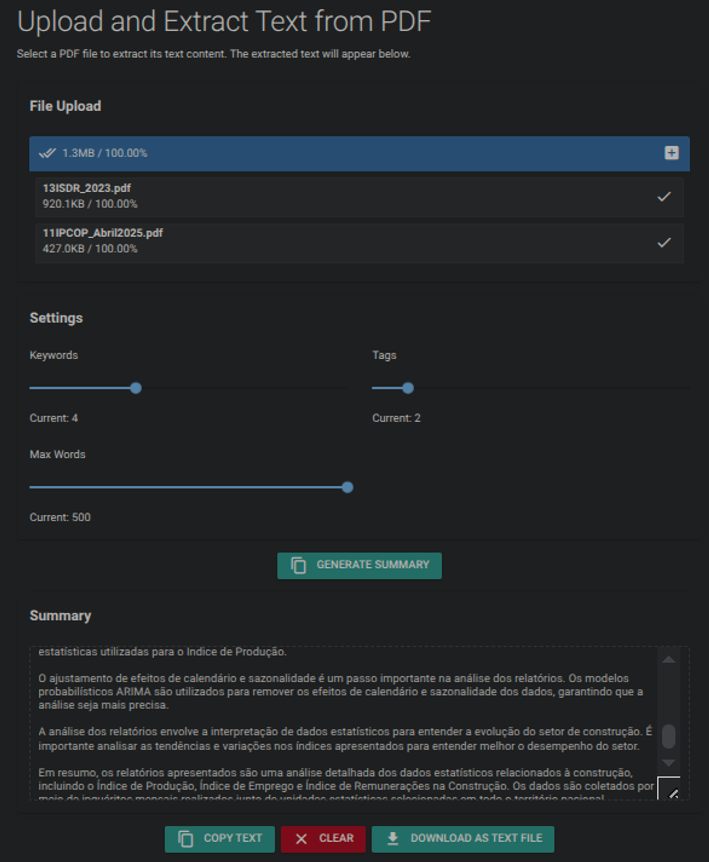

# D12.1 - WP12 Prototypes: Hackathon Outcomes, Scope and Next Steps

## Deliverable description

This deliverable ("D12.1 - WP12 LLM prototype A") summarises the results of task T12.2 within work package 12 (WP12) of the AIML4OS project. The task aimed to develop at least two proof-of-concept demonstrators based on pre-existing large language models (LLMs) for specific use cases in official statistics. The prototypes were built during an international hackathon held in Lisbon in June 2025 and they illustrate how different combinations of open-source LLMs, frameworks and architectures can be used to solve practical problems. They are demonstrators, not production systems. Their maturity, scope and limitations are therefore described explicitly in this report.

The main documentation for the prototypes is available on GitHub. Each prototype repository includes a README, an architectural diagram and source code. These resources are intended to help other national statistical institutes reproduce the work, adapt it to local conditions and provide feedback. The prototypes are not ready for production and are not maintained as such; they are intended to inspire further development and to illustrate architectural considerations.

## Abstract

Large language models are rapidly evolving and offer new opportunities for official statistics. WP12 explores how LLMs can be applied to tasks such as metadata handling, text summarisation, code translation, chatbot-based dissemination and the analysis of large documents or web content. This deliverable presents three proof-of-concept prototypes developed during the Lisbon hackathon. It highlights the architectural choices, data protection considerations, demonstration scope and limitations of each prototype. The report also summarises lessons learned and identifies open issues to be addressed in subsequent deliverables (D12.5-D12.7).

## Introduction

The AIML4OS project aims to build a one-stop shop for artificial intelligence and machine learning in official statistics. Work package 12 focuses on large language models because of their rapidly increasing capabilities and potential to automate textual tasks. Given the pace of change in the LLM field, it is difficult to predict which specific applications will be most relevant in 2024-2027. Consequently, WP12 adopts an iterative approach: prototypes are developed using existing models to explore high-value areas, and guidance on architecture and fine-tuning is refined as experience is gained.

Task T12.2 organised a two-day hackathon in Lisbon bringing together participants from multiple national statistical institutes. The goal was to create at least one demonstrator using pre-existing LLMs. The collaborative format resulted in three distinct prototypes. Each prototype demonstrates how a different architectural choice (e.g. local model hosting vs. API calls) influences feasibility, efficiency and data protection. Because of the limited timeframe, the focus was on rapid prototyping rather than formal evaluation. The prototypes should therefore be interpreted as proofs of concept rather than production-ready applications.

To support this work, a reference diagram of generic architectural components has been used throughout the WP12 process. Originally developed within UNECE collaboration, this model illustrates how foundational AI models relate to surrounding infrastructure such as APIs, vector stores, frameworks, and user interfaces. The figure below is used throughout the report as a point of reference. The complete report can be found here: [https://unece.org/statistics/documents/2025/09/reports/generative-ai-official-statistics-hlg-mos-report](https://unece.org/statistics/documents/2025/09/reports/generative-ai-official-statistics-hlg-mos-report)

## Approach and Methodology

Task T12.2 was carried out through an iterative, collaborative approach that included preparatory meetings and a two-day hackathon held in Lisbon. The hackathon brought together participants from Portugal, the Netherlands, Sweden, Ireland, and Norway, with technical support from INSEE (France), who also provided infrastructure expertise via WP3.

A shared architectural perspective was adopted early in the process, and a joint set of evaluation criteria was established to guide prototype selection and development. These criteria included: efficiency gain, reusability, data accessibility, on-premise compatibility, feasibility, robustness of evaluation, expected lifespan, and whether the use case could be considered a low-hanging fruit for national statistical institutes.

Developing usable prototypes using realistic data, while still being able to openly share the results, was a recurring challenge. Significant effort went into designing use cases and workflows that could demonstrate practical value without relying on sensitive or non-shareable data sources. To address this, the group made use of the SSP-Cloud environment delivered by WP3. This platform provided a ready-to-use development space that supported experimentation with generative AI in a secure, reproducible and sharable setting.

SSP-Cloud also recently introduced support for locally hosted AI models, which aligned well with architectural goals related to data protection and on-premise compatibility. The availability of direct support from INSEE during the hackathon was instrumental in enabling rapid setup and problem-solving. This in turn increased the likelihood that the resulting prototypes could be reused or extended by others.

Each prototype's README describes how to set up the environment. Nevertheless, replicability depends on the availability of similar models and infrastructure. As generative AI models evolve rapidly, users who wish to reproduce the demonstrations may need to adjust the code or host older model versions.

## Prototypes Developed

Three independent prototypes were produced. They are hosted on GitHub under the [wp12_hackathon](https://github.com/AIML4OS/WP12/tree/main/wp12_hackathon) directory. Each prototype repository includes source code, a README explaining the use case and an architectural diagram. The following summaries describe the demonstration context, the purpose of each prototype and its scope and limitations.

### Prototype 1: Dissemination Summary

**Purpose.** This prototype uses a retrieval-augmented generation (RAG) pipeline to automatically summarise statistical reports and generate metadata tags in multiple languages. Users upload a PDF; the system extracts text, indexes it in a vector store and uses a prompting layer to create concise summaries in both the local language and English. Tags are derived to facilitate search and cataloguing.

**Demonstration context.** The prototype was implemented using open-source tools such as LangChain and Ollama. It runs in the SSP-Cloud environment and relies on specific LLMs available there at the time of the hackathon. The GUI shown below is a simple front-end to facilitate interaction.

**Scope and limitations.**

- **Proof-of-concept status.** The prototype demonstrates how LLMs can assist with dissemination workflows but is not production-ready. It was developed during a two-day sprint and has not undergone thorough evaluation or long-term maintenance. It serves as a starting point for further research rather than a finished product.
- **Environment dependencies.** The code assumes availability of specific models via the SSP-Cloud/Ollama environment. As the report notes, these models may be updated or replaced. Users wishing to reproduce the prototype must adapt to their own environment or pin model versions to ensure consistency.
- **Evaluation.** The team assessed the prototype qualitatively as highly reusable and adaptable. However, no formal benchmark against existing dissemination methods was performed due to time constraints.
- **Data protection.** The demonstration used publicly available reports. In operational settings, data protection strategies need to be defined when uploading reports containing sensitive information.

### Prototype 2: From PDF to Figures

**Purpose.** This prototype explores the automatic extraction of tables, figures and variables from PDF reports. By converting embedded statistical information into machine-readable form, it aims to support data validation, reuse and integration.

**Demonstration context.** The prototype uses LLM-based classification components within a framework-based orchestration. The team tested the approach on a small set of annual reports and focused on capturing variables such as company name, total revenue, net profit, revenue growth, number of employees and carbon emissions.

**Scope and limitations.**

- **Early development.** The prototype is at an exploratory stage. It illustrates the potential of LLMs for content extraction but requires significant refinement before it can be used operationally.
- **Dataset size.** Only a handful of reports were processed during the hackathon. A larger, diverse dataset is needed to evaluate accuracy and generalisability.
- **Model limitations.** LLM-based classification may struggle with complex layouts or multilingual documents. Additional preprocessing or custom models may be necessary.
- **External constraints.** Execution depends on the availability of PDF-parsing tools, vector stores and LLMs in the SSP-Cloud environment. The prototype does not include fallback mechanisms when these services change or become unavailable.

### Prototype 3: Web Corner Prototype

**Purpose.** This prototype uses LLMs to classify web pages according to a user-specified criterion. Given a list of URLs and a concept (e.g., "job vacancies"), the system identifies whether each website contains relevant information. It can be used for monitoring online sources for labour market statistics or similar applications.

**Demonstration context.** The solution combines web scraping utilities with a prompting framework. A dataset of company websites from four European countries was used to test the approach; the dataset originated from the [WIN Hackathon](https://cros.ec.europa.eu/book-page/win-hackathon) and included manually labelled variables related to e-commerce and social media presence.

**Scope and limitations.**

- **Proof-of-concept.** The prototype demonstrates feasibility but is not designed for continuous monitoring. It lacks error handling for dynamic web pages, rate limiting and long-term maintenance.
- **Evaluation robustness.** The hackathon team noted high efficiency and reusability but raised questions about consistent evaluation and stability across diverse web content. No quantitative metrics were computed.
- **Dataset bias.** The WIN Hackathon dataset may not represent all sectors or languages. Results may not generalise without retraining or adaptation.
- **Execution constraints.** The prototype requires internet access and scraping permissions. It may be affected by website terms of service or changes in page structure.

## Common Architecture Patterns and Technical Choices

Across all three prototypes, a modular architectural pattern emerged. Each group made use of frameworks such as LangChain or similar orchestration tools to manage LLM interactions. This trend reflects a broader evolution in the generative AI ecosystem, where much of the added value stems not from the base models alone, but from how they are wrapped, prompted, and integrated into surrounding systems.

The prototypes illustrated how architectural decisions - such as model hosting (cloud vs. on-prem), API strategy, or data preprocessing - can significantly impact dimensions such as scalability, maintainability, and data protection. For instance, models hosted locally via tools like Ollama enabled teams to bypass external APIs, reducing concerns about data leakage or service dependency, whereas API-based solutions offered simpler setup but raised privacy considerations.

Using a shared environment like SSP-Cloud made it possible to test these architectural choices under common conditions. It also provided a natural bridge between experimentation and potential operationalisation, since other teams can replicate the setup and test the prototypes without starting from scratch.

The figure including architecture components illustrates the range of architectural components considered during this work and serves as a reference for understanding the diversity of integration paths explored.

## Findings, Lessons Learned and Unresolved Issues

### Hackathon experience and lessons learned

The cross-functional hackathon facilitated collaboration, learning and rapid prototyping. A shared environment lowered the threshold for experimentation and reuse. Early alignment on architecture helped avoid mismatched expectations. The prototypes demonstrated that LLM-based solutions can deliver efficiency gains and reusability for certain statistical workflows. However, the limited timeframe meant that formal evaluation and robustness testing were not possible.

### Unresolved issues and implications for future deliverables

- **Maturity and maintenance.** None of the prototypes are maintained as production systems. They serve as starting points. The deliverable therefore highlights the need for further development to improve robustness, scalability, evaluation and documentation.
- **Scope limitations.** The demonstrations used small datasets and controlled environments. The results cannot be generalised without further testing on diverse data. This limitation should be clearly stated to avoid misinterpretation.
- **Environment dependencies.** Replicating the prototypes requires access to SSP-Cloud or an equivalent environment with similar models and tools. As noted, the models available in SSP-Cloud are updated regularly. Users should either lock model versions or update the code to work with newer models.
- **Evaluation and benchmarking.** Formal evaluation against existing manual or static methods is lacking. Future work should include quantitative metrics to compare LLM-based approaches with current practices.
- **Data protection and ethics.** Applying LLMs to official statistics raises concerns about privacy, transparency and bias. Prototypes need to incorporate auditing, interpretability and compliance with national and EU data-protection regulations.
- **Integration with WP12 tasks.** The findings from D12.1 will feed into subsequent deliverables (D12.5-D12.7) that focus on additional prototypes and a report on architectural aspects of LLM usage. Future prototypes can build on the lessons learned here by selecting use cases that allow formal evaluation and by incorporating fine-tuning (Task T12.3).

## Next Steps

The following steps could be relevant for upcoming prototypes within the AIML4OS project, as part of the ongoing maintenance of the repository content, or for organisations that wish to continue the work and test the prototypes in their own environments.

1. **Extend prototypes into training resources.** Adapt the prototypes to serve as hands-on tutorials for staff in national statistical institutes. This may involve cleaning the code, writing step-by-step guides, adding unit tests, and ensuring that each prototype README explains how to run the code, where to find test data and what environment is required.
2. **Plan formal evaluation.** For subsequent deliverables, select use cases that allow systematic comparison between LLM-based approaches and traditional methods. Define evaluation metrics (e.g. accuracy, processing time, resource consumption) and collect representative datasets.
3. **Address environment and model updates.** Provide guidance on how to replicate the prototypes outside SSP-Cloud. Consider containerising the solutions and documenting how to specify exact model versions to ensure reproducibility.

## Acknowledgements

This work was carried out as part of the AIML4OS project and received funding from the European Union's Horizon Europe programme (Grant agreement No 101146355). We thank all hackathon participants from Portugal, the Netherlands, Sweden, Ireland, Norway, France, Slovenia, Italy and Poland for their contributions. We also thank Eurostat and the Central Statistics Office (Ireland) for their feedback on the first version of this report, which has helped clarify the scope and limitations of the prototypes.

