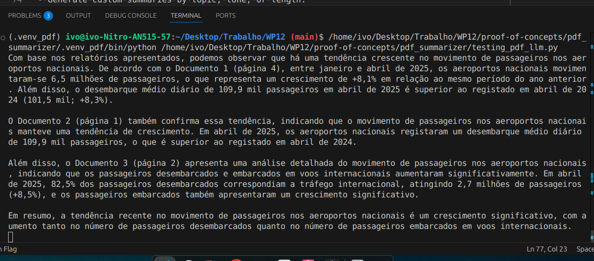
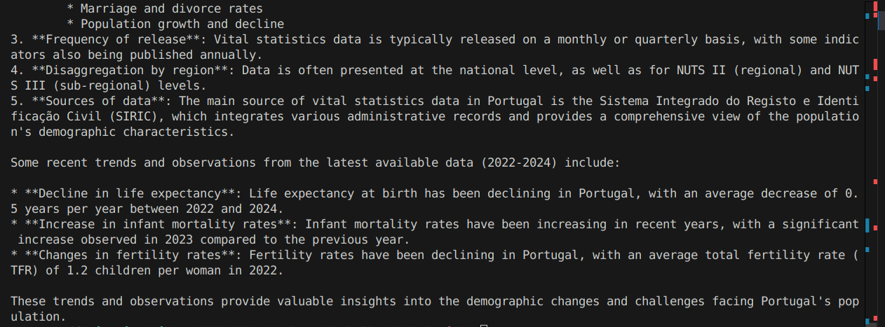

# AI-Powered Multilingual PDF Summarizer

## 📘 Overview

This Proof-of-Concept (POC) is an AI-powered system capable of **consuming** and **summarizing** PDF documents in various languages, adapting to different user requests. Whether you're looking for a short summary, a detailed report, or a topic-focused extraction, the system intelligently tailors its response based on your input.

## ✨ Features

- 🧠 **Intelligent Summarization**: Uses advanced language models to create meaningful summaries.
- 🌍 **Multilingual Support**: Automatically detects and processes PDFs in multiple languages.
- 🎯 **Adaptive Output**: Responds to user queries such as “short summary,” “summary focused on X topic,” or “summary in Y language.”
- 📄 **PDF Text Extraction**: Handles complex layouts and multilingual text via robust PDF parsing.
- 🖥️ **CLI**: Command-line use (and in a near future a simple web UI).

## 🛠️ Tech Stack

- Python 3.12+
- PDF Parsing: `PyPDFLoader` (from LangChain Community)
- Vector Database: `ChromaDB`
- AI Framework: Ollama (**free**, and **local**)


## 🚀 Getting Started

### 1. Install the dependencies

```bash
pip install -r requirements.txt
```

### 3. Set Virtual Environment
Create a venv inside the `dissemination_summary_prototype` folder:
```bash
python -m venv .venv_pdf
```

### 4. Setting the PDFs
Put the PDFs you desire in the data folder.

### 5. Create the ChromaDB instance
Run the file `create_chroma_db.py`
```bash
python create_chroma_db.py
```
It should create a folder called `chroma_db`

### 6. Ollama
Ollama allows you to run **freely**, and **locally** (on-premises) an llm, with minimal setup.
1. Install Ollama
2. Fetch llama3.2 llm, by using
```bash
ollama run llama3.2
```
Note: Ollama will run as an enabled service, in Linux. This means it will start whenever your 
OS starts, and Linux will try to restart it, if by any chance the service goes down.


### 7. Test Llama3.2
We are now ready to go! 
Just insert your question in the `testing_pdf_lmm.py` file, and run it.
```bash
python testing_pdf_lmm.py
```
<figure>
  
  <figcaption>Figure 1: In Portuguese.</figcaption>
</figure>
<figure>
  
  <figcaption>Figure 1: In English.</figcaption>
</figure>

## 🧾 Example Use Cases

- Summarize international research papers.
- Extract executive summaries from foreign-language reports.
- Generate custom summaries by topic, tone, or length.
- Translate and summarize in the user’s preferred language.

## 📂 Project Structure

```
pdf-summarizer/
├── testing_pdf_llm.py         # Entry point for summarizing PDFs
├── data                       # Empty folder which will include your PDFs
├── create_chroma_db.py        # script to create a chroma db with your pdfs
├── ollama_pdf.py              # script to create the RAG
├── requirements.txt           # Python dependencies
└── README.md                  # POC documentation
```

## 📌 Roadmap

- [x] Multilingual text extraction
- [x] Adaptive summarization prompts
- [x] WebUI
- [ ] Uploader


Made with (several) 🤖 , and ❤️ by Ivo Tavares
