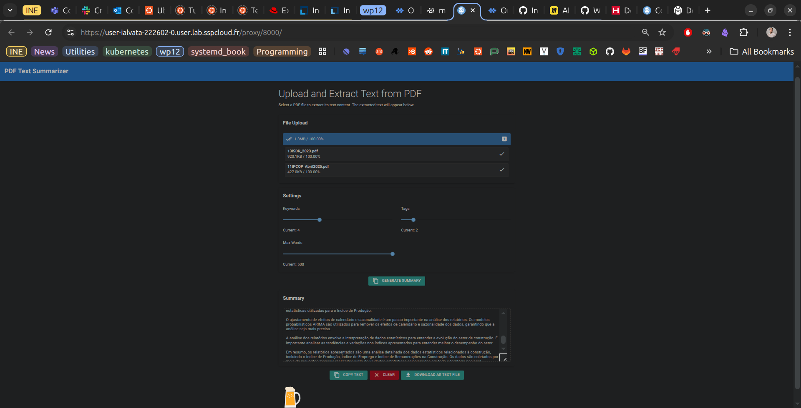

# AI-Powered Multilingual PDF Summarizer

## 📘 Overview

This Proof-of-Concept (POC) is an AI-powered system capable of **consuming** and **summarizing** PDF documents in various languages, adapting to different user requests. Whether you're looking for a short summary, a detailed report, or a topic-focused extraction, the system intelligently tailors its response based on your input.

## ✨ Features

- 🧠 **Intelligent Summarization**: Uses advanced language models to create meaningful summaries.
- 🌍 **Multilingual Support**: Automatically detects and processes PDFs in multiple languages.
- 🎯 **Adaptive Output**: Responds to user queries such as “short summary,” “summary focused on X topic,” or “summary in Y language.”
- 📄 **PDF Text Extraction**: Handles complex layouts and multilingual text via robust PDF parsing.
- 🖥️ **CLI**: Command-line use (and in a near future a simple web UI).

## 🛠️ Tech Stack

- Python 3.12+
- PDF Parsing: `PyPDFLoader` (from LangChain Community) and `pypdf`
- Vector Database: `ChromaDB`
- Templates: `LangChain`
- AI Framework: `Ollama` 

All **free**, and **local**!


## 🚀 Getting Started


### 1. Set Virtual Environment
Create a venv inside the `dissemination_summary_prototype` folder:
```bash
python -m venv .venv_pdf
```

### 2. Install the dependencies

```bash
pip install -r requirements.txt
```

### 3. Setting Ollama
Ollama allows you to run **freely**, and **locally** (on-premises) an llm, with minimal setup.
1. Install Ollama:
```bash
curl -fsSL https://ollama.com/install.sh | sh
```
2. Run: 
```bash
ollama serve
```
3. Fetch llama3.2 llm, by using
```bash
ollama run llama3.2
```
Note: Usually Ollama will run as an enabled service, in Linux. 
This means it will start whenever your 
OS starts, and Linux will try to restart it, if by any chance the service goes down.
In SSPCloud, however, because we're in a container, there's no systemd. I must run ollama 
manually.


### 4. Lauch main.py
We are now ready to go! 
Just run:
```bash
python main.py
```
<figure>
  
  <figcaption>Figure 1: In Portuguese.</figcaption>
</figure>

### 5. Notes on Infrastructure

If we are hosting Ollama in another server, and through a proxy, we may need to pass Ollama's
ip address in the client.
```python
# Replace with the actual IP and port of your Ollama instance
ollama_host = "http://new_ollama_ip:11434"

# Initialize the Ollama model with the custom host
llm = Ollama(model="llama3", base_url=ollama_host)
```

If you want to run this in Onyxia:
1. [Launch VSCode Service](https://datalab.sspcloud.fr/launcher/ide/vscode-pytorch-gpu?name=vscode-pytorch-gpu&version=2.3.16&s3=region-79669f20&networking.user.enabled=true&networking.user.ports[0]=8000&autoLaunch=true)

2. Run the commands in the `onyxia_init.sh` script.
(Currently, I haven't been able to run it as an init script in Onyxia, since the script takes too long and onyxia thinks the container is dead)

## 🧾 Example Use Cases

- Summarize international research papers.
- Extract executive summaries from foreign-language reports.
- Generate custom summaries by topic, tone, or length.
- Translate and summarize in the user’s preferred language.
- All of these, **locally** and **free**! 

## 📂 Project Structure

```
prototybe_b/
├── main.py                    # Entry point for Web App
├── rag_system                 # Folder containing RAG system
├── gui                        # Folder containing NiceGUI 
├── onyxia_init.sh             # script to initialise VSCode GPU service
├── requirements.txt           # Python dependencies
└── README.md                  # POC documentation
```

## 📌 Roadmap

- [x] Multilingual text extraction
- [x] Adaptive summarization prompts
- [x] Web GUI
- [x] Uploader
- [x] RAGSystem
- [ ] Improve Templates
- [ ] Improve Web GUI


Made with (several) 🤖 , and ❤️ by Ivo Tavares
